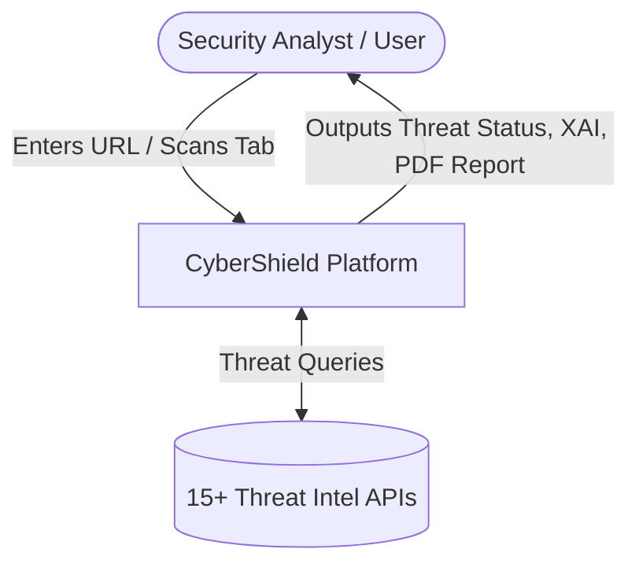
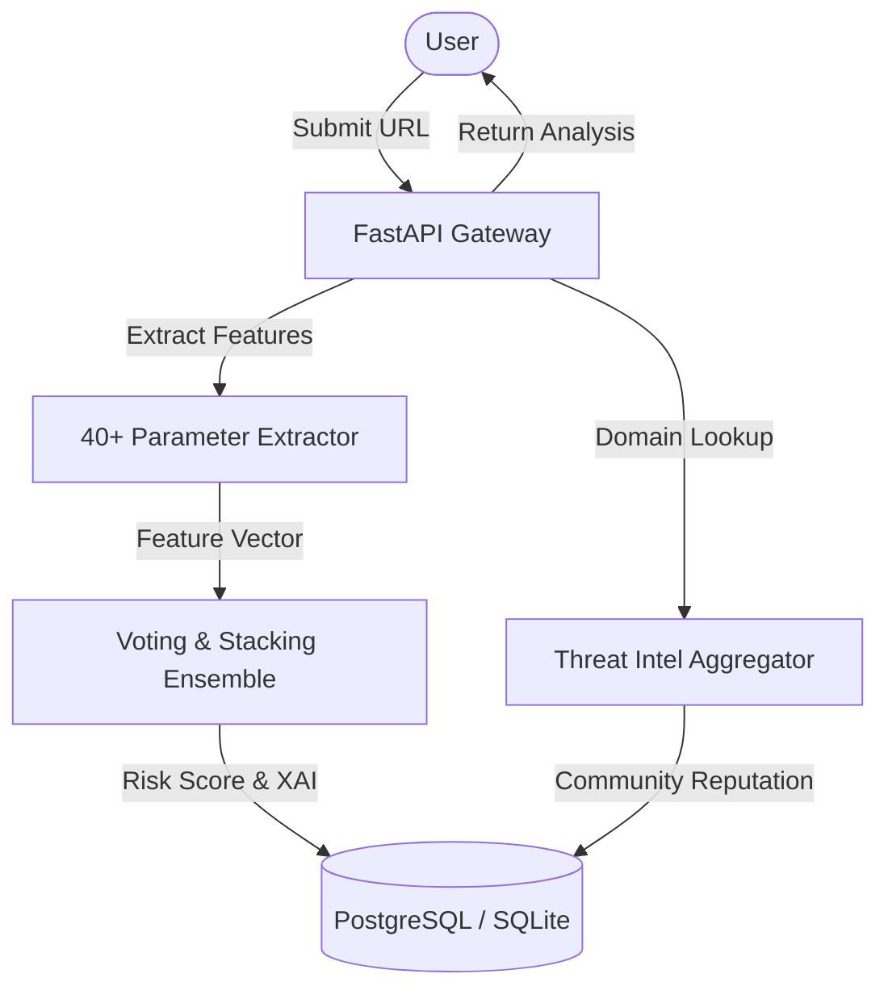
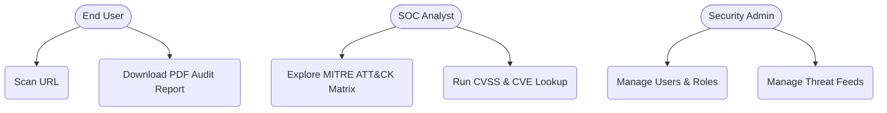
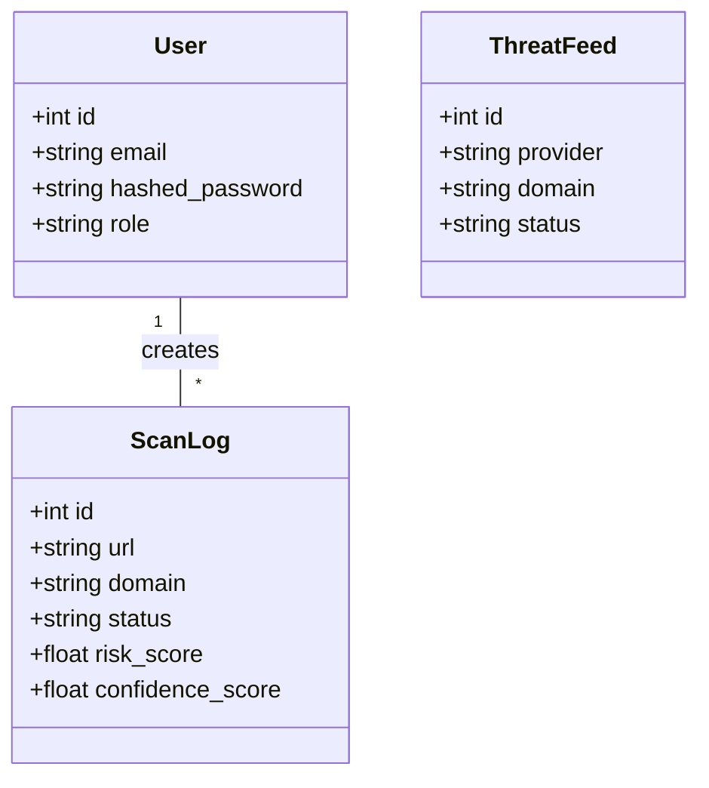
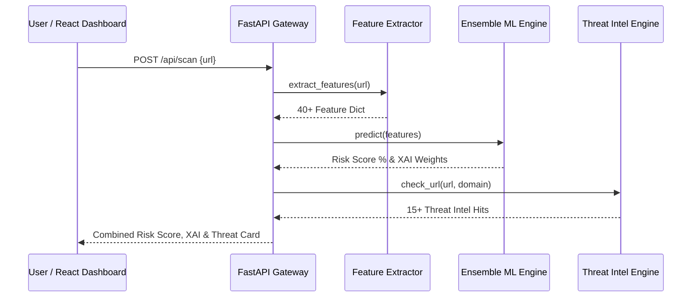
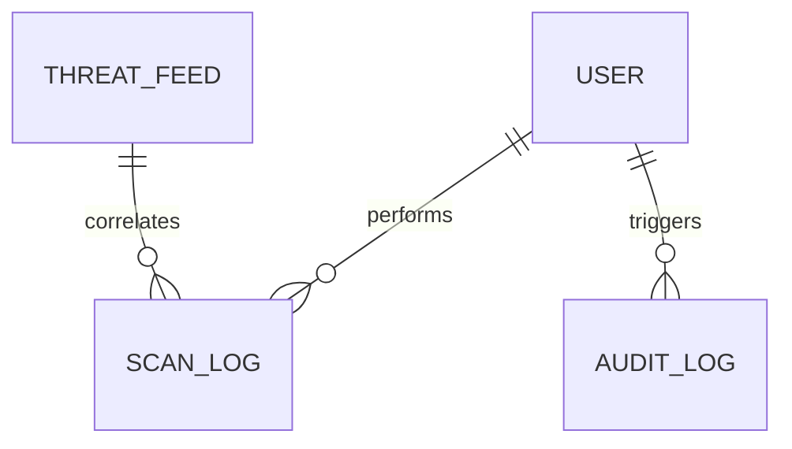
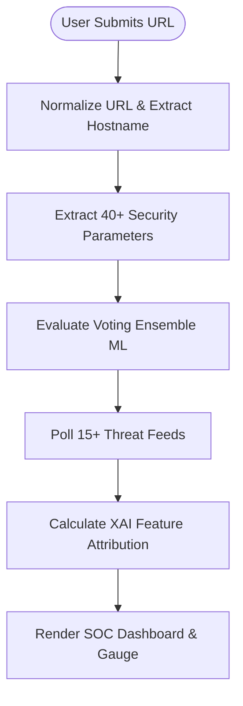
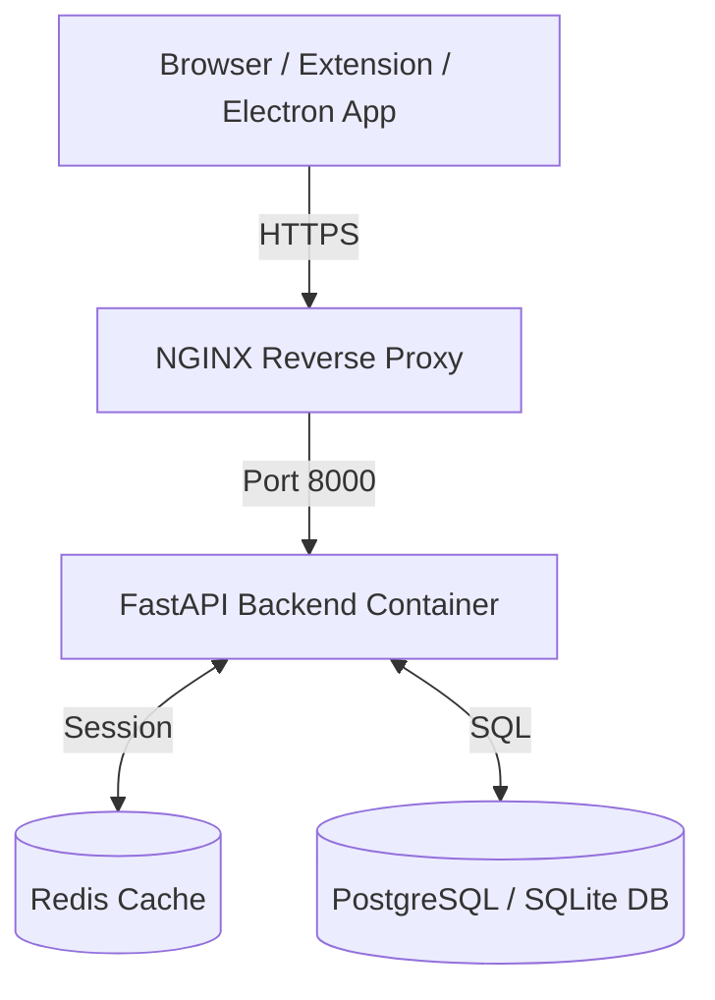
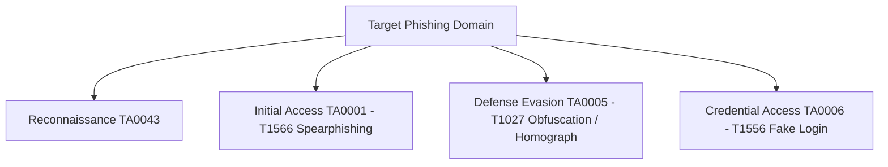
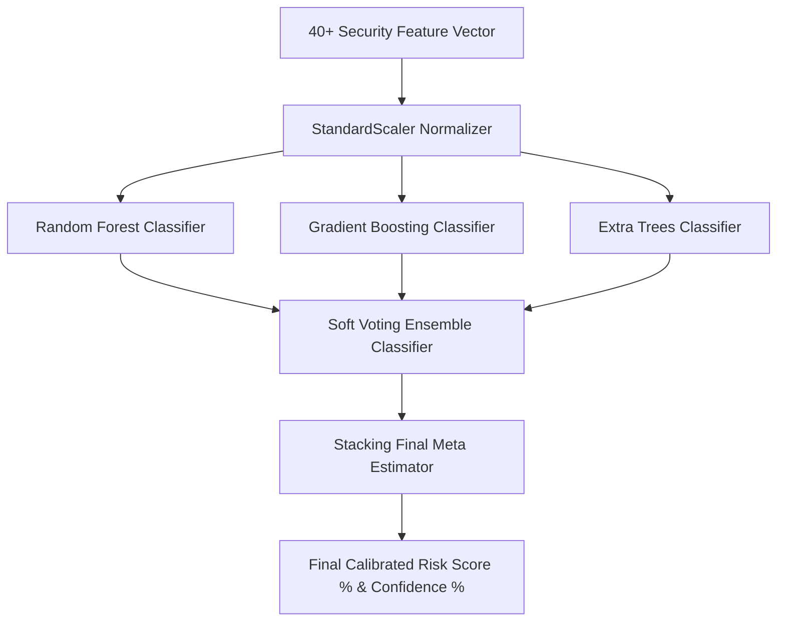

# System Requirements Specification (SRS)
## Project Title: CyberShield Enterprise - AI Cyber Threat Intelligence & SOC Governance Platform

---

## 1. Introduction & Executive Summary
CyberShield Enterprise is a full-stack AI security platform that combines 40+ real-time security feature extractions, Explainable AI (XAI) feature attribution, Voting & Stacking Ensemble Machine Learning, 15+ Threat Intelligence integrations, MITRE ATT&CK threat mapping, multi-format PDF security reports, and Role-Based Access Control (RBAC).

---

## 2. System Architecture & 10 Mermaid Diagrams

### Diagram 1: Data Flow Diagram Level 0 (Context Diagram)

### Diagram 2: Data Flow Diagram Level 1

### Diagram 3: Use Case Diagram

### Diagram 4: Class Diagram

### Diagram 5: Sequence Diagram

### Diagram 6: Entity-Relationship Diagram (ERD)

### Diagram 7: Activity Diagram

### Diagram 8: Deployment Diagram

### Diagram 9: MITRE ATT&CK Threat Mapping Diagram

### Diagram 10: Multi-Model Ensemble Machine Learning Architecture

---

## 3. Functional Requirements
- **FR-1**: Fast 40+ parameter URL extraction without network dependencies during training.
- **FR-2**: Voting and Stacking Ensemble ML classification with SHAP/LIME Explainability.
- **FR-3**: 15+ Threat Intelligence integrations with intelligent fallback.
- **FR-4**: JWT OAuth2 authentication with Admin, Analyst, and User RBAC.
- **FR-5**: 1-click ReportLab PDF security audit report generation.
